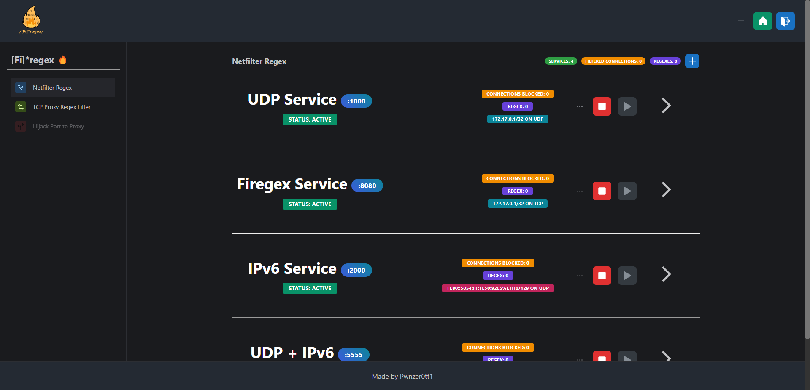
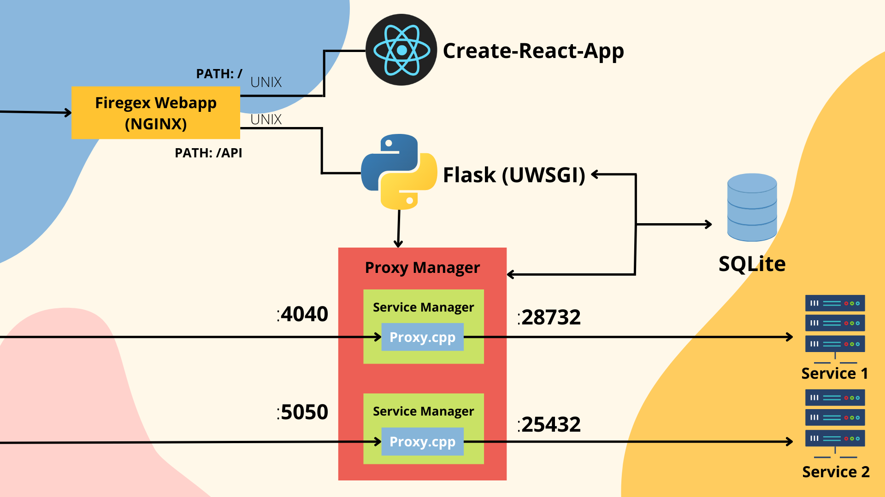

# [Fi]*regex 🔥

<a href="https://github.com/Pwnzer0tt1/firegex/releases/latest"></a>  <a href="https://discord.gg/79NNVJBK5Z" target="_blank"></a> 

## What is Firegex?
Firegex is a firewall that includes different functionalities, created for CTF Attack-Defence competitions that has the aim to limit or totally deny malicious traffic through the use of different kind of filters.

## Get started firegex
What you need is a linux machine and docker ( + docker-compose )
```bash
curl https://raw.githubusercontent.com/Pwnzer0tt1/firegex/main/start.py -o firegex.py && python3 firegex.py
```
With this command you will download firegex.py, and run it, it will require you the password to use for firegex and start it with docker-compose

Or, you can start in a similar way firegex, cloning this repository and executing this command
```bash
python3 start.py
```
Cloning the repository you could use the `--build` option that will build a new image of firegex, this can be usefull if you need change some code of firegex, and run it with the new code.
Image building of firegex will require more time, so it's recommended to use the version just builded and available in the github packages

By default firegex will start in a multithread configuration using the number of threads available in your system.
The default port of firegex is 4444. At the startup you will choose a password, that is essential for your security.
All the configuration at the startup is customizable in [firegex.py](./start.py) or directly in the firegex interface.



## Functionalities

- Regex filtering using [NFQUEUE](https://netfilter.org/projects/libnetfilter_queue/doxygen/html/) with [nftables](https://netfilter.org/projects/nftables/) uses a c++ file that handle the regexes and the requests, blocking the malicius requests. PCRE2 regexes are used. The requests are intercepted kernel side, so this filter works immediatly (IPv4/6 and TCP/UDP supported)
- TCP Proxy regex filter, create a proxy tunnel from the service internal port to a public port published by the proxy. Internally the c++ proxy filter the request with PCRE2 regexes. For mantaining the same public port you will need to open only in localhost the real services. (Available only on TCP/IPv4)
- Port Hijacking allows you to redirect the traffic on a specific port to another port. Thanks to this you can start your own proxy, connecting to the real service using the loopback interface. Firegex will be resposable about the routing of the packets using internally [nftables](https://netfilter.org/projects/nftables/)

## Documentation

Find the documentation of the backend and of the frontend in the related README files

- [Frontend (React)](frontend/README.md)
- [Backend (FastAPI + C++)](backend/README.md)



### Main Points of Firegex
#### 1. Efficiency
Firegex should not slow down the traffic on the network. For this the core of the main functionalities of firegex is a c++ binary file.
#### 2. Availability
Firegex **must** not become a problem for the SLA points!
This means that firegex is projected to avoid any possibility to have the service down. We know that passing all the traffic through firegex, means also that if it fails, all services go down. It's for this that firegex implements different logics to avoid this. Also, if you add a wrong filter to your services, firegex will always offer you a fast or instant way to reset it to the previous state.

## Why "Firegex"?
Initiially the project was based only on regex filters, and also now the main function uses regexes, but firegex have and will have also other filtering tools. 

# Credits 
- Copyright (c) 2007 Arash Partow (http://www.partow.net) for the base of our proxy implementation
- Copyright (c) 2022 Pwnzer0tt1

# TODO:

## Next points

- Add proxy script in different language to use for porthijacking to download
- Explanation about tools in the dedicated pages making them more user-friendly
- buffering the TCP and(/or) the UDP stream to avoid to bypass the proxy dividing the information in more packets
- Adding new section with "general firewall rules" to manage "simple" TCP traffic rules graphically and through nftables
