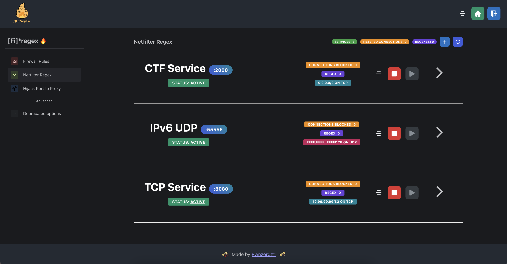

<h1><br />[Fi]*regex 🔥</h1>

<a href="https://github.com/Pwnzer0tt1/firegex/releases/latest"></a>   


<br />

## What is Firegex?
Firegex is a firewall that includes different functionalities, created for CTF Attack-Defense competitions that has the aim to limit or totally deny malicious traffic through the use of different kind of filters.

## Get started firegex

### Docker Mode (Recommended)
What you need is a linux machine and docker ( + docker-compose )
```bash
# One-command installer (works for both Docker and standalone modes)
sh <(curl -sLf https://pwnzer0tt1.it/firegex.sh)
```
With this command you will download firegex.py, and run it, it will require you the password to use for firegex and start it with docker-compose

Or, you can start in a similar way firegex, cloning this repository and executing this command
```bash
python3 run.py start --prebuilt
```

Without the `--prebuilt` flag, it will build the docker image from source, which may take longer.

### Standalone Mode
If Docker is not available or you're running in a rootless environment, Firegex can run in standalone mode. The one-command installer above also works for standalone mode and will automatically detect and use standalone mode when Docker is unavailable.

```bash
sh <(curl -sLf https://pwnzer0tt1.it/firegex.sh)

# Or manually force standalone mode:
python3 run.py start --standalone
# Or directly using the one-command installer:
sh <(curl -sLf https://pwnzer0tt1.it/firegex.sh) --standalone

# Check status
python3 run.py status [--standalone]

# Stop standalone mode
python3 run.py stop [--standalone]
```

Standalone mode automatically:
- Downloads pre-built rootfs from GitHub releases
- Detects your architecture (amd64/arm64)
- Sets up chroot environment with necessary bind mounts
- Runs as a background daemon process
- Manages PID files for process control

If the server is restarted, docker mode will automatically restart the service, while standalone mode will require you to run the start command again manually.

Cloning the repository run.py will automatically build the docker image of firegex from source, and start it.
Image building of firegex will require more time, so it's recommended to use the version just builded and available in the github packages.
This is default behaviour if run.py is not in the firegex source root directory.

By default firegex will start in a multithread configuration using the number of threads available in your system.
The default port of firegex is 4444. At the startup you will choose a password, that is essential for your security.
All the configuration at the startup is customizable in [firegex.py](./run.py) or directly in the firegex interface.



## Functionalities

- Regex filtering using [NFQUEUE](https://netfilter.org/projects/libnetfilter_queue/) with [nftables](https://netfilter.org/projects/nftables/) uses a c++ file that handle the regexes and the requests, blocking the malicius requests. PCRE2 regexes are used. The requests are intercepted kernel side, so this filter works immediatly (IPv4/6 and TCP/UDP supported)
- Create basic firewall rules to allow and deny specific traffic, like ufw or iptables but using firegex graphic interface (by using [nftable](https://netfilter.org/projects/nftables/))
- Port Hijacking allows you to redirect the traffic on a specific port to another port. Thanks to this you can start your own proxy, connecting to the real service using the loopback interface. Firegex will be resposable about the routing of the packets using internally [nftables](https://netfilter.org/projects/nftables/)
- EXPERIMENTAL: Netfilter Proxy uses [nfqueue](https://netfilter.org/projects/libnetfilter_queue/) to simulate a python proxy, you can write your own filter in python and use it to filter the traffic. There are built-in some data handler to parse protocols like HTTP, and before apply the filter you can test it with fgex command (you need to install firegex lib from pypi).

## Documentation

Documentation about how the filters works, what features are available and how to use them are available on firegex interface.

Heres a brief description about the firegex structure:

- [Frontend (React)](frontend/README.md)
- [Backend (FastAPI + C++)](backend/README.md)

More specific information about how Firegex works, and in particular about the nfproxy module, are available here (in italian only): [https://github.com/domysh/engineering-thesis](https://github.com/domysh/engineering-thesis) (PDF in the release attachments)


### Main Points of Firegex
#### 1. Efficiency
Firegex should not slow down the traffic on the network. For this the core of the main functionalities of firegex is a c++ binary file.
#### 2. Availability
Firegex **must** not become a problem for the SLA points!
This means that firegex is projected to avoid any possibility to have the service down. We know that passing all the traffic through firegex, means also that if it fails, all services go down. It's for this that firegex implements different logics to avoid this. Also, if you add a wrong filter to your services, firegex will always offer you a fast or instant way to reset it to the previous state.

## Why "Firegex"?
Initiially the project was based only on regex filters, and also now the main function uses regexes, but firegex have and will have also other filtering tools. 

# Credits
- Copyright (c) 2022-2025 Pwnzer0tt1

## Star History

<a href="https://star-history.com/#pwnzer0tt1/firegex&Date&secret=Z2hwXzJ3TWljWkV5SzBwd216YkJNSGo2OTd0YW1wRGRHZjIwR29jbA==">
 <picture>
   <source media="(prefers-color-scheme: dark)" srcset="https://api.star-history.com/svg?repos=pwnzer0tt1/firegex&type=Date&theme=dark&secret=Z2hwXzJ3TWljWkV5SzBwd216YkJNSGo2OTd0YW1wRGRHZjIwR29jbA==" />
   <source media="(prefers-color-scheme: light)" srcset="https://api.star-history.com/svg?repos=pwnzer0tt1/firegex&type=Date&secret=Z2hwXzJ3TWljWkV5SzBwd216YkJNSGo2OTd0YW1wRGRHZjIwR29jbA==" />
   
 </picture>
</a>
