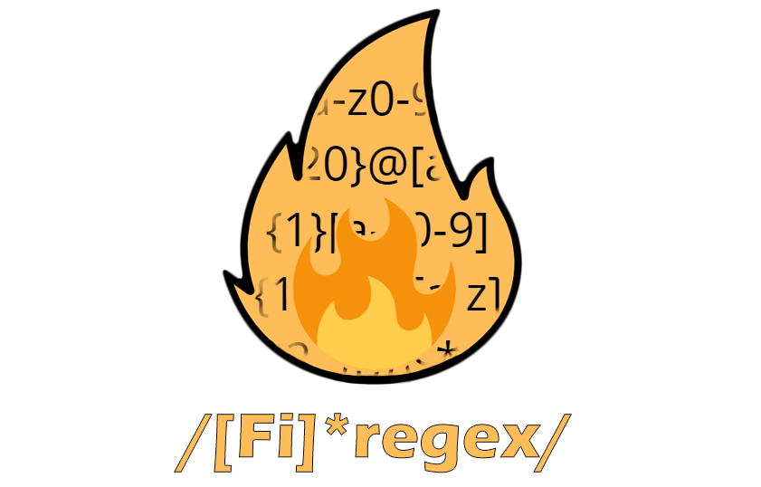
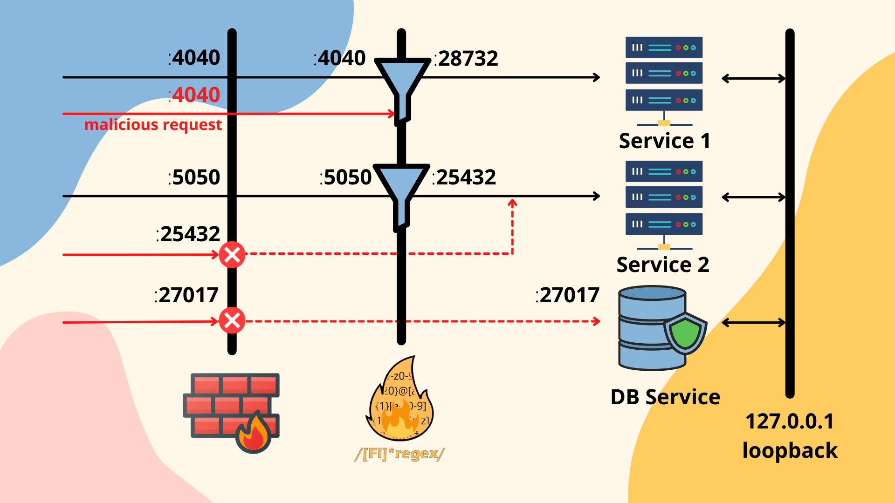

# Firegex 

## What is Firegex?
Firegex is a reverse-proxy application firewall created for CTF Attack-Defence competitions that has the aim to limit of totally deny TCP malicious traffic throught the use of regex filters.

Firegex don't replace the network firewall, but works together with it.

## How it works?

When you start firegex, the first step is to create the services that it has to proxy.
The name of the service and the port where is expected to be hosted are the only things required. For each service, a random intermediate port is generated.
You can start all the services you have created on the proxy. If the port it's free, firegex will blind it, and forward the connection to the random port generated, it's expected that the real service will start at that port. If the port is already blinded, firegex will keep tring to blind that port until it will success. This allow to reduce the down time during the transition from the old port to the new port used by the real service. When the real service will have changed port, the proxy will automatically handle the port and start proxying the real with the port setted on the firewall.

Remember to start the service with the intermediate port publishing this only on localhost network or blocking the public access using a network firewall.

Now, you can enter in the service detail, and manage the filtering rules to use for each services. Thet service can be in 4 different states:
- START: The proxy is running and it's filtering all tcp packets using the regex added
- PAUSE: The proxy is running, but it's not filtering the packets, it's only keeping the service active continuing forwarding the packets
- WAIT: The proxy is not running, but it's waiting until the port to blind will be free, after that the proxy will go in PAUSE or START mode according to what requested previously
- STOP: The proxy is not running.

You can change the status clicking the button provided in the frontend. If you want to add a regex or delete a regex you can add or remove it, and if the service is in START mode, the regex changes will have an immediate effect on the proxy that will start following the new ruleset.

## Documentation

Find the documentation of the backend and of the frontend in the related README files

- [Frontend (React)](frontend/README.md)
- [Backend (Flask + C++)](backend/README.md)

### Main Points of Firegex
#### 1. Efficiency
Firegex should not slow down the traffic on the network. For this the core of firegex it's a c++ binary file.
1. The proxy itself is build with a binary c++ file that uses the boost library, well-known for it's stability and efficiency.
2. The proxy works thanks to async io calls, granting great efficiency and minimum time loss
3. The filter is done by the binary file using the regex std c++ library (in the firsts versions of firegex, the boost::regex library was used, but after some tests, and the rising of some problems with this library, we passed to the std lib also looking at the similar efficiency and more stability with the same tests we done)
#### 2. Availability
Firegex **must** not become a problem for the SLA points!
This means that firegex is projected to avoid any possibility to have the service down. We know that passing all the traffic through firegex, means also that if it fails, all services go down. It's for this that firegex implements different logics to avoid this.
1. Every reverse proxy is isolated from each other, avoiding the crash of all the proxies started by firegex
2. The proxy is a binary program written in C, started as an indipendent process with indipendent memory, and uses boost lib for the connection and the std lib for checking the regex for each packet
3. If a regex fails for whatever reason, the proxy remove this from the filter list and continue to forward the packets like it did't exist.
4. If the firewall is restarted, at the startup it try to rebuild the previous status of proxies
5. The firewall interface it's protected by a password. No one excepts your team must have access to firegex, this can be really really dangerous!
6. If a regex makes trouble, you can delete it (this have an instant effect on the proxy), or put the service in pause (call also Transparent mode), this will deactivate all the filters from the proxy, but still continue to publish the service on the right port
7. Every status change (except if you decide to stop the proxy) that you made to the service, and so to the proxy is instantaneous and done with 0 down time. The proxy is **never** restarted, it's configuration changes during runtime
    