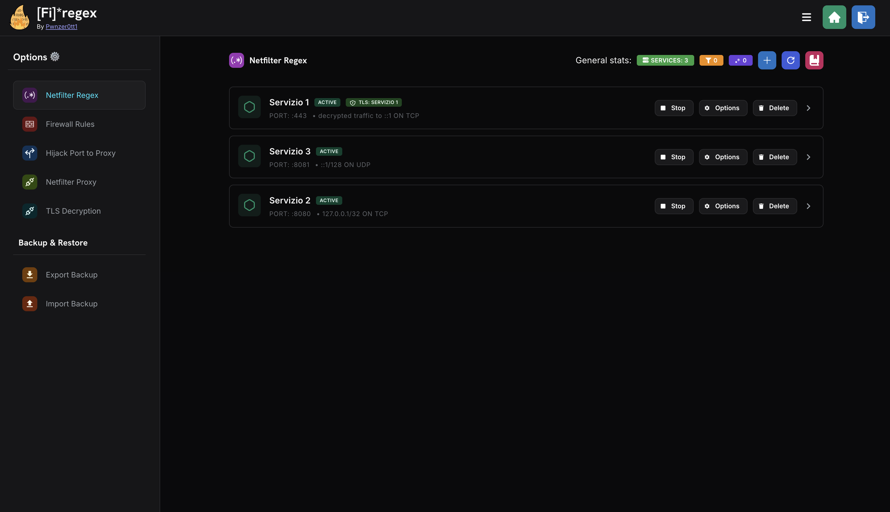
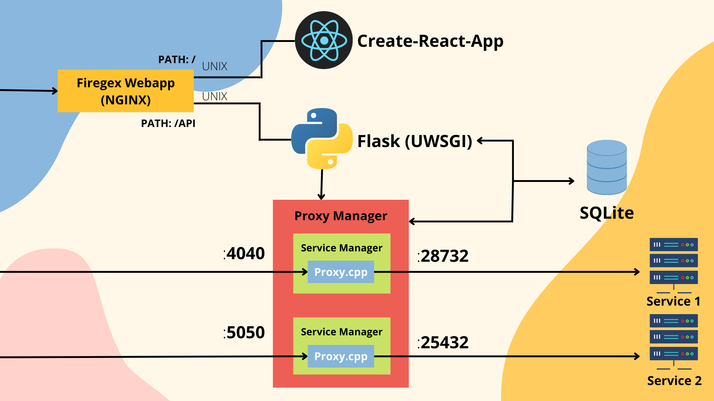

<h1><br />[Fi]*regex 🔥</h1>

<a href="https://github.com/Pwnzer0tt1/firegex/releases/latest"></a>   

You can see a demo [here](https://demo.firegex.pwnzer0tt1.it/)


<br />

## What is Firegex?
Firegex is a firewall that includes different functionalities, created for CTF Attack-Defense competitions that has the aim to limit or totally deny malicious traffic through the use of different kind of filters.

## Get started firegex

### Docker Mode (Recommended)
What you need is a linux machine and docker ( + docker-compose )
```bash
# One-command installer (works for both Docker and standalone modes)
sh <(curl -sLf https://pwnzer0tt1.it/firegex.sh)
```
With this command you will download firegex.py, and run it, it will require you the password to use for firegex and start it with docker-compose

Or, you can start in a similar way firegex, cloning this repository and executing this command
```bash
python3 run.py start --prebuilt
```

Without the `--prebuilt` flag, it will build the docker image from source, which may take longer.

### Standalone Mode
If Docker is not available or you're running it in a rootless environment, Firegex can run in standalone mode. The one-command installer above also works for standalone mode and will automatically detect and use standalone mode when Docker is unavailable or in rootless mode.

```bash
sh <(curl -sLf https://pwnzer0tt1.it/firegex.sh)

# Or manually force standalone mode:
python3 run.py start --standalone
# Or directly using the one-command installer:
sh <(curl -sLf https://pwnzer0tt1.it/firegex.sh) --standalone

# Check status
python3 run.py status [--standalone]

# Stop standalone mode
python3 run.py stop [--standalone]
```

Standalone mode automatically:
- Downloads pre-built rootfs from GitHub releases
- Detects your architecture (amd64/arm64)
- Sets up chroot environment with necessary bind mounts
- Runs as a background daemon process
- Manages PID files for process control

If the server is restarted, docker mode will automatically restart the service, while standalone mode will require you to run the start command again manually.

Cloning the repository run.py will automatically build the docker image of firegex from source, and start it.
Image building of firegex will require more time, so it's recommended to use the version just builded and available in the github packages.
This is default behaviour if run.py is not in the firegex source root directory.

By default firegex will start in a multithread configuration using the number of threads available in your system.
The default port of firegex is 4444. At the startup you will choose a password, that is essential for your security.
All the configuration at the startup is customizable in [firegex.py](./run.py) or directly in the firegex interface.

### Managing the configuration

`run.py` has a dedicated `config` subcommand to inspect or change the persisted settings (port, host, socket dir, allowed IPs, password) without needing to stop or rebuild firegex:

```bash
# Show the current configuration
python3 run.py config --show

# Change the port/host firegex will bind to on the next start
python3 run.py config --port 8080 --host 0.0.0.0

# Reset the password of an already-running instance
# (omit the value to be prompted for it interactively instead)
python3 run.py config --password newpassword
```

This is especially useful if you lost the current password: it's applied directly to the running instance (or the standalone rootfs) without requiring the old one.



## Functionalities

- **[Services](docs/services.md)**: the main module. A service is one protected endpoint described in two independent parts — a **network layer** that says how its traffic is intercepted, and an ordered chain of **filters** that says what happens to it.
  - A service protects a **list of addresses or network interfaces**, mixing IPv4, IPv6 and network interfaces (`eth0`, `wg0`, etc.) freely: intercept traffic on specific IPs or directly across an entire interface. Adding an address or interface to a running service drops no connections.
  - Network layer: **NFQUEUE** (packets lifted to userspace with [nfqueue](https://netfilter.org/projects/libnetfilter_queue/) and [nftables](https://netfilter.org/projects/nftables/), nothing terminated, the kernel keeps forwarding if a filter dies) or **proxy** (the connection is terminated and reopened, which buys kernel reassembly, an unlimited ordered chain of filters, TLS termination and real backpressure — while still dialling your service from the client's own address, so it never stops seeing who is talking to it).
  - Filters: **regex**, matched by [hyperscan](https://github.com/VectorCamp/vectorscan) — the same engine on either layer, so a pattern means the same thing wherever it runs — or **Python**, your own code written against the [`firegex`](https://pypi.org/project/firegex/) library, with built-in models for HTTP and TCP streams. You never declare which protocol a Python filter speaks: asking for an `HttpRequest` is what makes it an HTTP filter, and a filter reads the addresses and ports as metadata while the payload is the only thing it can change.
  - A regex **blocks** the connection, and that is deliberately all it does: rewriting had to scan one chunk at a time, so a pattern split across two TCP segments went through unredacted with nothing to say it had — a rule you trust and that quietly does not apply is worse than no rule. To change bytes rather than refuse them, use a Python filter, which sees the reassembled stream.
  - **TLS** is one of the protocols a service can speak, not a separate thing to create: the proxy engine terminates the connection itself, the filters inspect the plaintext, and it is re-encrypted towards your service — with the client's ALPN mirrored rather than invented, and the decrypted stream written to a `firegex0` interface you can point a capture at. A TLS service occupies no extra port.
  - Or **your own proxy** as the network layer: firegex rewrites the destination on the way in and changes it back on the way out, so a proxy you wrote yourself sits in the path invisibly. The escape hatch for a protocol nothing built in understands.
  - **TCP or UDP**, on every layer — with full source IP transparency on both. On the proxy layer, UDP datagrams are relayed with one dedicated socket per address using transparent IP spoofing (`IP_TRANSPARENT`), with per-flow filter state and zero-downtime dynamic address additions. NFQUEUE filters packets in place with kernel-level fail-open.
  - **The two inspecting layers are opposite trades, [compared side by side in the interface itself](docs/services.md#network-layers) while you choose**: the proxy owns both halves of a connection, so the kernel reassembles for it and a Python filter can rewrite a payload exactly, at the cost of rebuilding fail-open by hand; NFQUEUE is per packet and keeps forwarding by kernel guarantee if a filter dies, at the cost of userspace reassembly and a process per filter.
  - **Charts of what each filter has refused** — per filter, per pattern and per `@pyfilter` function, each with **its share of the blocking**. Pick the window (last 15 minutes, hour, 6h, 24h, everything kept, or two exact instants) and the shape (bars, lines, stacked area, or share); **everything on the page counts the same window**, so the chart and the table beside it can never tell different stories. Alongside it, how much traffic arrived, in the unit each layer can honestly report.
  - **The Python editor knows the library**: completion and hover for every model and its members — marking which of them you may write to — and the file is **checked as you type by the process that will run it**, so a mistake is flagged on its own line with the reason instead of surfacing later as "worker exited". The hints are introspected from the installed library, so they cannot drift from it.
  - A **live log** per service shows what it is doing as it does it: what refused each connection (by name and pattern, not an opaque id), whatever your Python prints, and what the datapath says about its own health.
  - A **pattern tester** is built in, and it runs the very engine that will enforce the answer — so a pattern it accepts is one you can save, and one it rejects tells you why in the engine's own words.
- **[Firewall Rules](docs/firewall.md)**: create basic firewall rules to allow and deny specific traffic, like ufw or iptables but using firegex graphic interface (by using [nftable](https://netfilter.org/projects/nftables/))

Firegex can also be restricted to accept connections only from a set of trusted CIDR ranges (`--allowed-ips`, optionally combined with `--proxy-ip-header` when running behind a reverse proxy) — see `python3 run.py start -h`.

### Reverse proxy without Firegex authentication

To delegate access control entirely to a reverse proxy, start Firegex with `--unsafe-disable-auth`:

```bash
python3 run.py start --host 127.0.0.1 --unsafe-disable-auth -P 'a-password-for-later'
```

This disables Firegex's password, JWT, and Socket.IO authentication: **every request that reaches Firegex is a full administrator**, so bind it to loopback, a Unix socket, or otherwise make sure nothing but the proxy can reach it. Requests forwarded by the proxy, including headers such as `X-Forwarded-For`, reach Firegex normally. Use `--no-unsafe-disable-auth` to turn the built-in authentication back on.

It can also be switched **while Firegex is running**, from either end:

- **From the interface**, under the menu's *Firewall Access* section: *Turn Authentication Off* takes effect on the next request. The browser that did it keeps its session, so the same menu offers *Turn Authentication On* to undo it. A browser that arrives afterwards does not get that option — while authentication is off, anyone who can reach Firegex could otherwise set their own password and keep you out for good.
- **From the host**, with `python3 run.py config --unsafe-disable-auth` / `--no-unsafe-disable-auth`. This is the one that sticks: it writes to the running instance *and* persists the choice for the next start. A change made from the interface lasts only until Firegex restarts, since the start-up flag is what it comes up with. `config --password` re-enables it on its own — see below.

A few things worth knowing before using it:

- **The setting is persisted** in `.firegex-conf.json`, like `--port` or `--allowed-ips`: a later plain `python3 run.py start` keeps authentication disabled until you pass `--no-unsafe-disable-auth`. Every start prints a banner while it is active, and `python3 run.py config --show` reports it — including when the running instance currently disagrees with it.
- **Set a password anyway** (`-P` at first start). Without one, `--no-unsafe-disable-auth` brings Firegex up in its initial-setup state, where anyone who can reach it chooses the password.
- **`config --password` turns authentication back on**, if it was off — setting a password is asking for one to be asked for, and a password that is stored but never checked is worse than no password because it reads like one. It applies to the running instance and to the next start, both. Pass `--keep-auth-disabled` for the one case where that is not what you want: an instance held open behind a proxy that authenticates, with a password kept ready for the day it is not.
- **The password cannot be changed over the API** while authentication is disabled (`/api/login`, `/api/set-password` and `/api/change-password` answer `403`) — otherwise an anonymous caller could plant a credential that keeps working once authentication is back on. `python3 run.py config --password` still works, since it writes to the database from the host, and it takes effect on the next request rather than on the next restart.
- **`--allowed-ips` is not a substitute for the proxy's access control.** Combined with `--proxy-ip-header` it trusts a client-supplied header, so it only holds up if the proxy overwrites that header and nothing else can reach the port directly.

## Documentation

Each module above has its own markdown guide under [`docs/`](docs/), covering how to use it and how it works internally. The same files are rendered directly in the Firegex web interface (via the docs button on each page), so they're always in sync with what you see in the app.

Heres a brief description about the firegex structure:

- [Frontend (React)](frontend/README.md)
- [Backend (FastAPI + C++ and Rust datapaths)](backend/README.md)
- [Python filter library (`firegex`/`fgex` pip package)](fgex-lib/README.md)

More specific information about how Firegex works, and in particular about the Python filter engine (called `nfproxy` at the time), are available here (in italian only): [https://github.com/domysh/engineering-thesis](https://github.com/domysh/engineering-thesis) (PDF in the release attachments)



### Main Points of Firegex
#### 1. Efficiency
Firegex should not slow down the traffic on the network. For this the core of the main functionalities of firegex is a c++ binary file.
#### 2. Availability
Firegex **must** not become a problem for the SLA points!
This means that firegex is projected to avoid any possibility to have the service down. We know that passing all the traffic through firegex, means also that if it fails, all services go down. It's for this that firegex implements different logics to avoid this. Also, if you add a wrong filter to your services, firegex will always offer you a fast or instant way to reset it to the previous state.

## Why "Firegex"?
Initiially the project was based only on regex filters, and also now the main function uses regexes, but firegex have and will have also other filtering tools. 

# Credits
- Copyright (c) 2022-2026 Pwnzer0tt1
