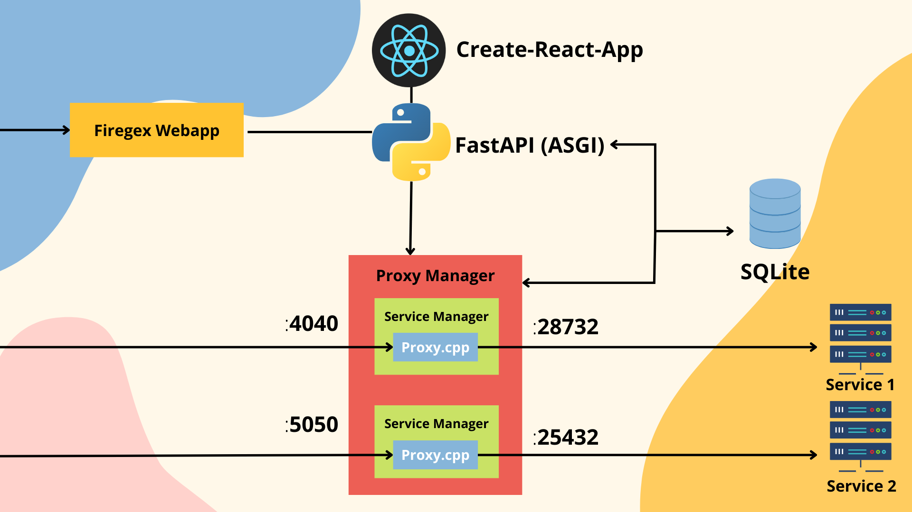

# Firegex backend

## [GO BACK](../README.md)

The backend of firegex is written with flusk, runned by uwsgi. The aim of the backend is to manage all the requests from the react front-end and manage also the proxy processes of the entire firewall. For this reason the backend is divided into 2 main parts:



## The Flask module
This module recieve the requests and manage these doing some queries to the SQLite DB, or sending signals and request to the Proxy-Manager module.
## The Proxy Manager
The proxy manager is started by the flask backend, but is indipendent from that. The proxy manager offers the api to the backend for abstract the managment of the proxies needed to make the firewall working. This module use also the SQLite db to syncronize its data about the packet filtered, the status of services and the regex added/removed.
For each service created this module create a Thread that manage all the complexity about make working the proxy, updating it's status from the database.


Firegex is reliable thanks to the fact that it's proxy it's not a python proxy, but it it's wrote in c++ using boost lib. This allow to have an high efficency proxy and high efficency regex filter match. A python wrapping and ubstraction module allow the use of this binary, that it's not been thought to be easy to use for humans. The wrapper allow to have from the binary all the needed statistics, and update it's status and it's regex without any downtime of the service: the changes are catched and executed during the execution of the proxy.

## [GO BACK](../README.md)

# API Documentation
## Index

### Platform API
- [Platform and session status](#get-apistatus)
- [Login](#post-apilogin-only-in-run-mode)
- [Logout](#get-apilogout)
- [Change Password](#post-apichange-password-only-in-run-mode--login-required)
- [Set Password](#post-apiset-password-only-in-init-mode)
### Data API
- Info API
    - [General stats](#get-apigeneral-stats-login-required)
- Services: 
    - [Add service](#post-apiservicesadd-login-required)
    - [Delete service](#get-apiserviceservdelete-login-required)
    - [Service info](#get-apiserviceserv-login-required)
    - [List services](#get-apiservices-login-required)
- Regexes:
    - [Add regex](#post-apiregexesadd-login-required)
    - [Delete regex](#get-apiregexregexiddelete-login-required)
    - [Regex info](#get-apiregexregexid-login-required)
    - [Service regexes](#get-apiserviceservregexes-login-required)
- Proxy Managment API
    - [Stop service](#get-apiserviceservstop-login-required)
    - [Start service](#get-apiserviceservstart-login-required)
    - [Pause service](#get-apiserviceservpause-login-required)
    - [Regenerate public port](#get-apiserviceservregen-port-login-required)


#
## **GET** **```/api/status```** 
### Server response:
```jsonc
{
    "status": <"run"|"init">,
    "loggined": <is true if the request is have a loggined session cookie>
}
```

#
## **POST** **```/api/login```** `ONLY IN RUN MODE`
### Client request:
```jsonc
{
    "password": <the firewall password>,
}
```
### Server response:
```jsonc
{
    "status": <"ok"/"Wrong password!"/"Cannot insert an empty password!">
}
```

#
## **GET** **```/api/logout```**
### Server response:
```jsonc
{
    "status": "ok",
}
```

#
## **POST** **```/api/change-password```** `ONLY IN RUN MODE` + `LOGIN REQUIRED`
### Client request:
```jsonc
{
    "password": <the firewall password>,
    "expire": <if true, the app secret key will be changed causing the logout of every session>
}
```
### Server response:
```jsonc
{
    "status": <"ok"/"Cannot insert an empty password!">
}
```

#
## **POST** **```/api/set-password```** `ONLY IN INIT MODE`
### Client request:
```jsonc
{
    "password": <the firewall password>,
}
```
### Server response:
```jsonc
{
    "status": <"ok"/"Cannot insert an empty password!">
}
```

#
## **GET** **```/api/general-stats```** `LOGIN REQUIRED`
### Server response:
```jsonc
{
    "services": <total number of services>,
    "closed": <total number of rejected packets>,
    "regex": <total number of regexes>
}
```

#
## **GET** **```/api/services```**  `LOGIN REQUIRED`
### Server response:
```jsonc
[
    {
        "id": <service_id>,
        "status": <service status>,
        "public_port": <public port>,
        "internal_port": <internal port>,
        "n_packets": <number of rejected packets>,
        "n_regex": <number of regexes>
    },
    {
        // Another service
    }
]
```

#
## **GET** **```/api/service/<serv>```**  `LOGIN REQUIRED`
### Server response:
```jsonc
{
    "id": <service_id>,
    "status": <service status>,
    "public_port": <public port>,
    "internal_port": <internal port>,
    "n_packets": <number of rejected packets>,
    "n_regex": <number of regexes>
}
```

#
## **GET** **```/api/service/<serv>/stop```**  `LOGIN REQUIRED`
### Server response:
```jsonc
{
    "status": "ok"
}
```

#
## **GET** **```/api/service/<serv>/start```**  `LOGIN REQUIRED`
### Server response:
```jsonc
{
    "status": "ok"
}
```

#
## **GET** **```/api/service/<serv>/delete```**  `LOGIN REQUIRED`
### Server response:
```jsonc
{
    "status": "ok"
}
```

#
## **GET** **```/api/service/<serv>/pause```**  `LOGIN REQUIRED`
### Server response:
```jsonc
{
    "status": "ok"
}
```

#
## **GET** **```/api/service/<serv>/regen-port```**  `LOGIN REQUIRED`
### Server response:
```jsonc
{
    "status": "ok"
}
```

#
## **GET** **```/api/service/<serv>/regexes```**  `LOGIN REQUIRED`
### Server response:
```jsonc
[
    {
        "id": <regex id>,
        "service_id": <service_id>,
        "regex": <base64 encoded regex>,
        "is_blacklist": <true|false>,
        "is_case_sensitive": <true|false>,
        "n_packets": <number of blocked packets>,
        "mode": <"C"|"S"|"B"> // Client to server, server to client or both
    },
    {
        // Another regex
    }
]
```

#
## **GET** **```/api/regex/<regex_id>```**  `LOGIN REQUIRED`
### Server response:
```jsonc
{
    "id": <regex id>,
    "service_id": <service_id>,
    "regex": <base64 encoded regex>,
    "is_blacklist": <true|false>,
    "is_case_sensitive": <true|false>,
    "n_packets": <number of blocked packets>,
    "mode": <"C"|"S"|"B"> // Client to server, server to client or both
}
```

#
## **GET** **```/api/regex/<regex_id>/delete```**  `LOGIN REQUIRED`
### Server response:
```jsonc
{
    "status": "ok"
}
```

#
## **POST** **```/api/regexes/add```**  `LOGIN REQUIRED`
### Client request:
```jsonc
{
    "service_id": <service_id>,
    "regex": <base64 encoded regex>,
    "is_blacklist": <true|false>,
    "is_case_sensitive": <true|false>,
    "mode": <"C"|"S"|"B"> // Client to server, server to client or both
}
```
### Server response:
```jsonc
{
    "status": <"ok"|"Invalid regex"|"An identical regex already exists">
}
```

#
## **POST** **```/api/services/add```**  `LOGIN REQUIRED`
### Client request:
```jsonc
{
    "name": <the id used to identify the service>,
    "port": <the internal port>
}
```
### Server response:
```jsonc
{
    "status": <"ok"|"Name or/and port of the service has been already assigned to another service">
}
```

## [GO BACK](../README.md)