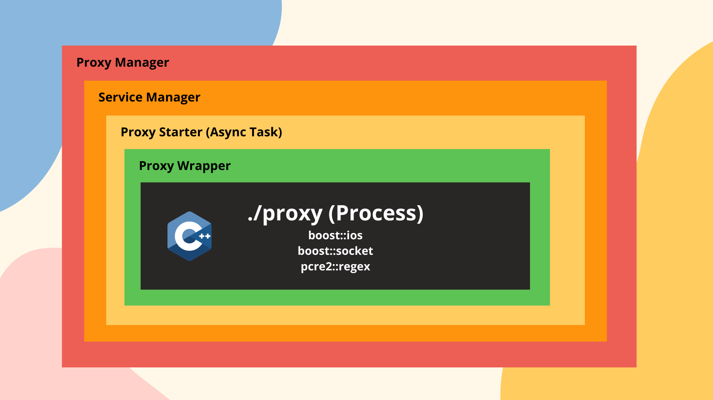

# Firegex backend

## [GO BACK](../README.md)

The backend of firegex is written with fastapi. The aim of the backend is to manage all the requests from the react front-end and manage also the proxy processes of the entire firewall. The fastapi webserver is responsable of deploying the react app.

## The Flask module
This module recieve the requests and manage these doing some queries to the SQLite DB, or sending signals and request to the Proxy-Manager module.
## The Proxy Manager
The proxy manager is started by the fastapi backend, but is indipendent from that. The proxy manager offers the api to the backend for abstract the managment of the proxies needed to make the firewall working. This module use also the SQLite db to syncronize its data about the packet filtered, the status of services and the regex added/removed.
For each service created this module create a Thread that manage all the complexity about make working the proxy, updating it's status from the database.

Firegex is reliable thanks to the fact that it's proxy it's not a python proxy, but it it's wrote in c++ using boost lib. This allow to have an high efficency proxy and high efficency regex filter match. A python wrapping and ubstraction module allow the use of this binary, that it's not been thought to be easy to use for humans. The wrapper allow to have from the binary all the needed statistics, and update it's status and it's regex without any downtime of the service: the changes are catched and executed during the execution of the proxy.

### All the documentation of the API you can go to /docs path and see the automatic onfiguration generated by FastAPI

## [GO BACK](../README.md)