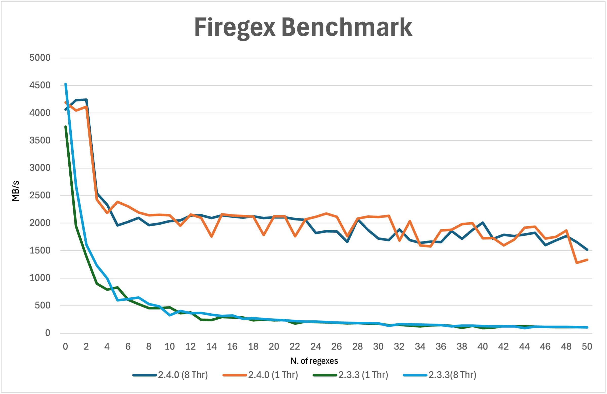
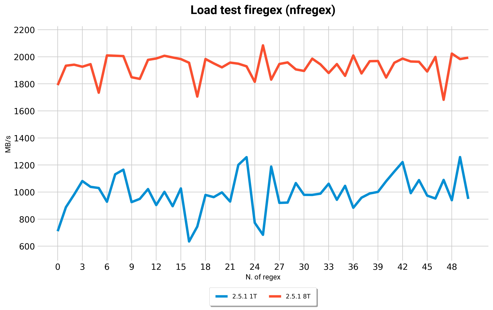
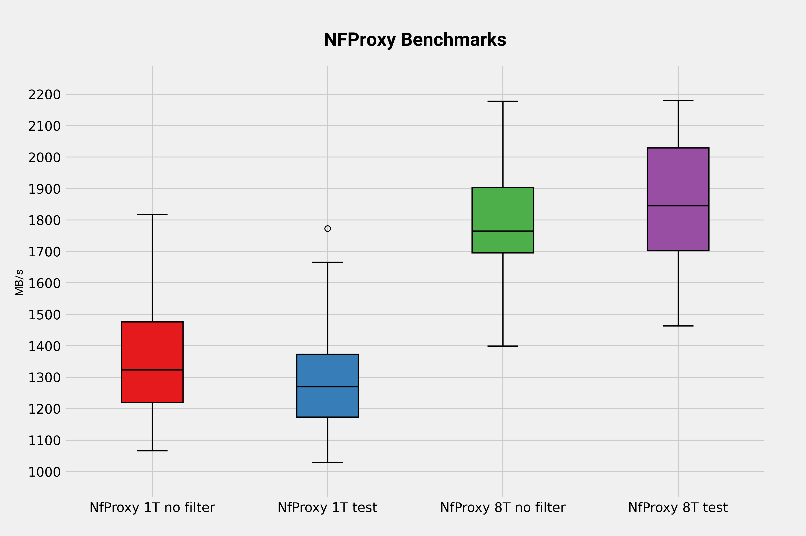
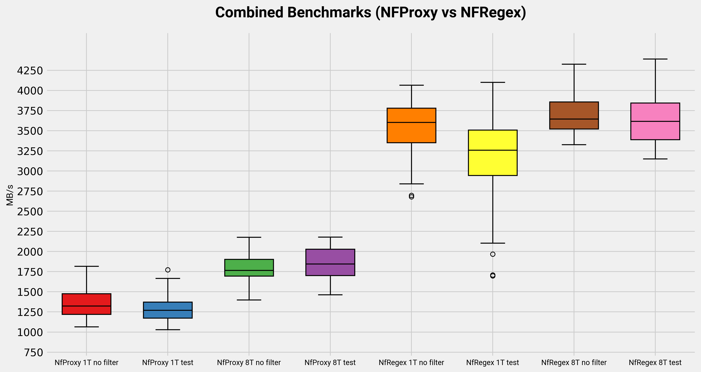
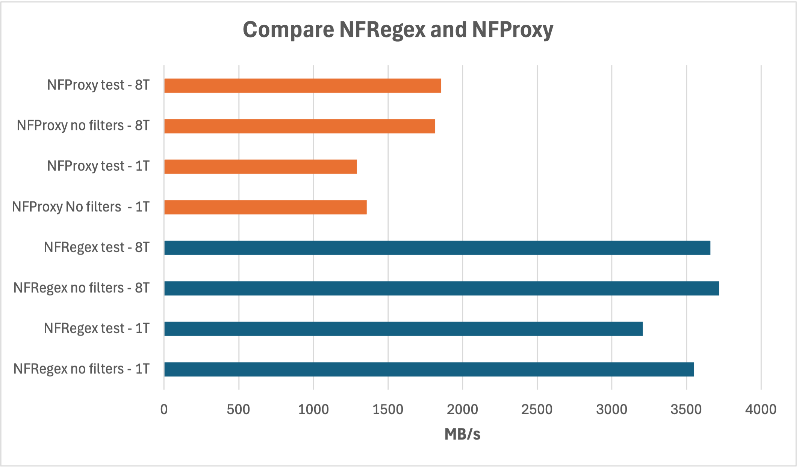

# Firegex tests

## [GO BACK](../README.md)

Tests are a quick and dirty way to check if your modification to the backend code didn't break anything.

# Running all the tests
If you are working on the same machine firegex is running on, you can just run run_tests.sh
```bash
$ ./run_tests.sh
```
It will automatically perform a general API test, Netfilter and Proxy Regex test. 
You can also run tests manually:
```bash
$ ./api_test.py -h
usage: api_test.py [-h] [--address ADDRESS] --password PASSWORD

$ ./nfregex_test.py -h
usage: nfregex_test.py [-h] [--address ADDRESS] --password PASSWORD [--service_name SERVICE_NAME] [--port PORT]
                [--ipv6] [--proto {tcp,udp}]

optional arguments:
-h, --help            show this help message and exit
--address ADDRESS, -a ADDRESS
                        Address of firegex backend
--password PASSWORD, -p PASSWORD
                        Firegex password
--service_name SERVICE_NAME, -n SERVICE_NAME
                        Name of the test service
--port PORT, -P PORT  Port of the test service
--ipv6, -6            Test Ipv6
--proto {tcp,udp}, -m {tcp,udp}
                    Select the protocol

$ ./px_test.py -h
usage: px_test.py [-h] [--address ADDRESS] --password PASSWORD [--service_name SERVICE_NAME] [--port PORT]

optional arguments:
-h, --help            show this help message and exit
--address ADDRESS, -a ADDRESS
                        Address of firegex backend
--password PASSWORD, -p PASSWORD
                        Firegex password
--service_name SERVICE_NAME, -n SERVICE_NAME
                        Name of the test service
--port PORT, -P PORT  Port of the test service
```
# Running a Benchmark
```bash
./benchmark.py
options:
-h, --help            show this help message and exit
--address ADDRESS, -a ADDRESS
                        Address of firegex backend
--port PORT, -P PORT  Port of the Benchmark service
--internal-port INTERNAL_PORT, -I INTERNAL_PORT
                        Internal port of the Benchmark service
--service-name SERVICE_NAME, -n SERVICE_NAME
                        Name of the Benchmark service
--password PASSWORD, -p PASSWORD
                        Firegex password
--num-of-regexes NUM_OF_REGEXES, -r NUM_OF_REGEXES
                        Number of regexes to benchmark with
--duration DURATION, -d DURATION
                        Duration of the Benchmark in seconds
--output-file OUTPUT_FILE, -o OUTPUT_FILE
                        Output results csv file
--num-of-streams NUM_OF_STREAMS, -s NUM_OF_STREAMS
                        Number of concurrent streams
--mode {netfilter,proxy}, -m {netfilter,proxy}
                        Type of filtering
```
Benchmarks let you evaluate the performance of the filters. You can run one by typing in a shell  ```test.py -p FIREGEX_PASSWORD -r NUM_OF_REGEX -d BENCHMARK_DURATION -m proxy``` to benchmark the Proxy based regex filter, or ``` -m netfilter ``` to benchmark the Netfilter based regex filtering.
It uses iperf3 to benchmark the throughput in MB/s of the server, both with filters, without filters, and for each new added regex. It will automatically add a new random regex untill it has reached NUM_OF_REGEX specified in the arguments. 

You will find a new benchmark.csv file containg the results.

# Firegex Performance Results

The test was performed on:
- Macbook Air M2 16GB RAM
- On a VM powered by OrbStack with Fedora Linux 41 (Container Image) aarch64
- Linux 6.12.13-orbstack-00304-gede1cf3337c4

Command: `./benchmark.py -p testpassword -r 50 -d 1 -s 50`

NOTE: 8 threads performance before 2.5.0 do not change due to the fact that the source and destination ip is always the same, so the packets are sent to the same thread by the kernel.
[https://netfilter.vger.kernel.narkive.com/sTP7613Y/meaning-of-nfqueue-s-queue-balance-option](https://netfilter.vger.kernel.narkive.com/sTP7613Y/meaning-of-nfqueue-s-queue-balance-option)

Internally the kernel hashes the source and dest ip and choose the target thread based on the hash. If the source and dest ip are the same, the hash will be the same and the packets will be sent to the same thread.
This is a problem in a CTF, where we usually have a NAT to hide real IPs.

Firegex 2.5.0 changes the way the threads are assigned to the packets, this is done userland, so we can have a better distribution of the packets between the threads.

The charts are labeled as follows: `[version]-[n_thread]T` eg. `2.5.0-8T` means Firegex version 2.5.0 with 8 threads.




From the benchmark above we can't see the real advantage of multithreading in 2.5.1, we can better see the advantage of multithreading in the chart below where a fake load in filtering is done.

The load is simulated by this code:
```cpp
volatile int x = 0;
for (int i=0; i<50000; i++){
    x+=1;
}
```



In the chart above we can see that the 2.5.1 version with 8 threads has a better performance than the 2.5.1 version with 1 threads, and we can see it as much as the load increases.

Command: `./comparemark.py nfproxy -p testpassword -d 1 -s 50 -V 100`

The code used to test matches the following regex with the python re module:
```
(?:[a-z0-9!#$%&'*+/=?^_`{|}~-]+(?:\.[a-z0-9!#$%&'*+/=?^_`{|}~-]+)*|"(?:[\x01-\x08\x0b\x0c\x0e-\x1f\x21\x23-\x5b\x5d-\x7f]|\\[\x01-\x09\x0b\x0c\x0e-\x7f])*")@(?:(?:[a-z0-9](?:[a-z0-9-]*[a-z0-9])?\.)+[a-z0-9](?:[a-z0-9-]*[a-z0-9])?|\[(?:(?:25[0-5]|2[0-4][0-9]|[01]?[0-9][0-9]?)\.){3}(?:25[0-5]|2[0-4][0-9]|[01]?[0-9][0-9]?|[a-z0-9-]*[a-z0-9]:(?:[\x01-\x08\x0b\x0c\x0e-\x1f\x21-\x5a\x53-\x7f]|\\[\x01-\x09\x0b\x0c\x0e-\x7f])+)\])
```




# Comparing nfproxy with nfregex

Nfproxy has obviously a worse performance than nfregex, but it is more flexible and can be used in more complex scenarios.





