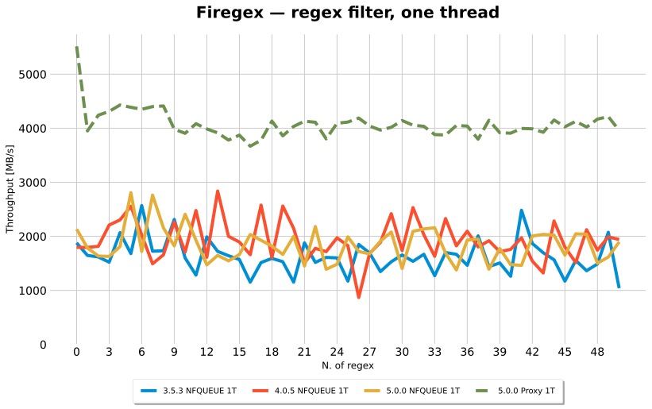
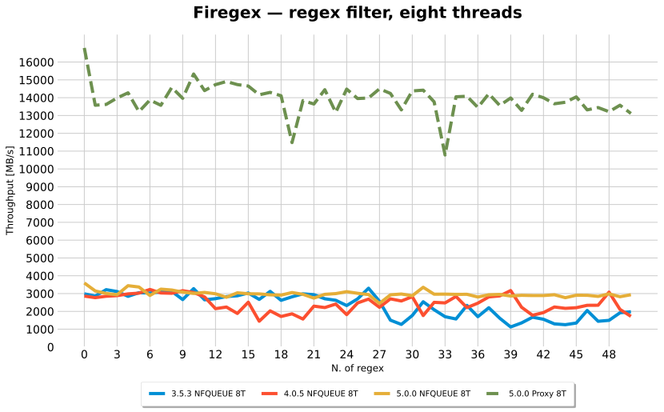
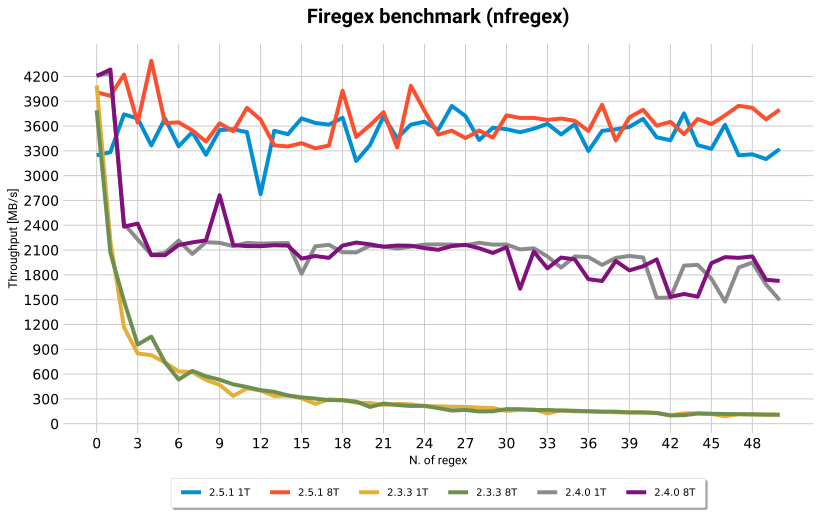
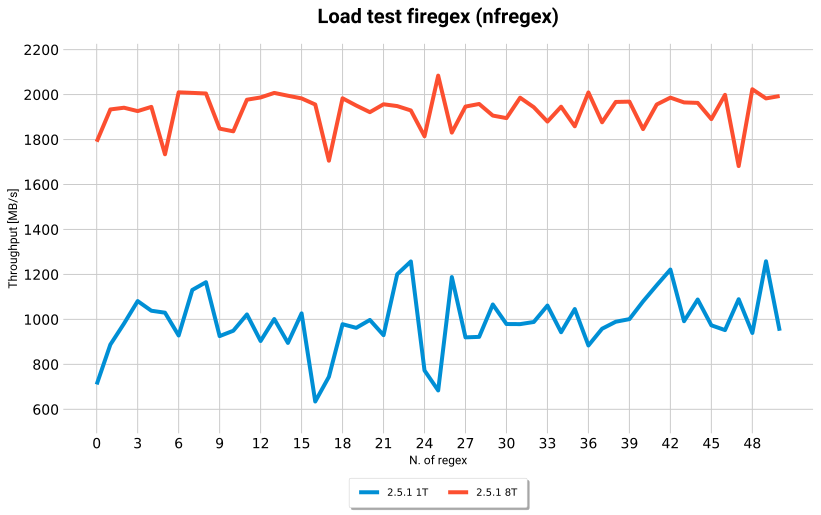
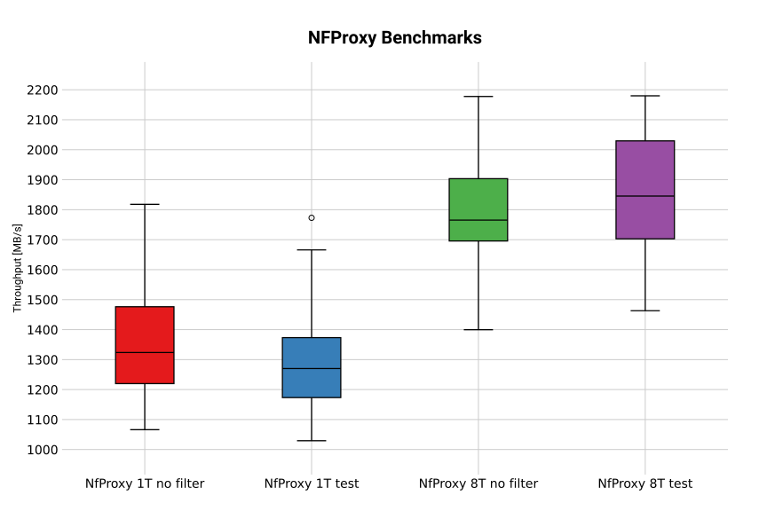
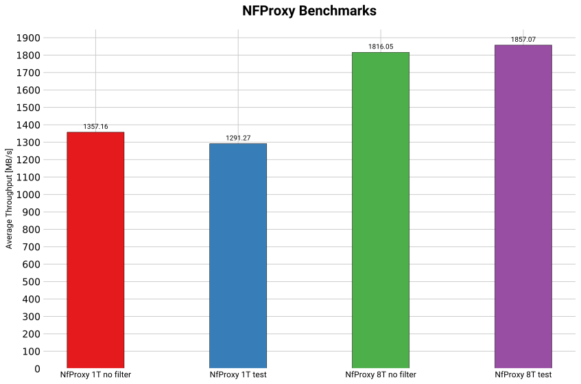
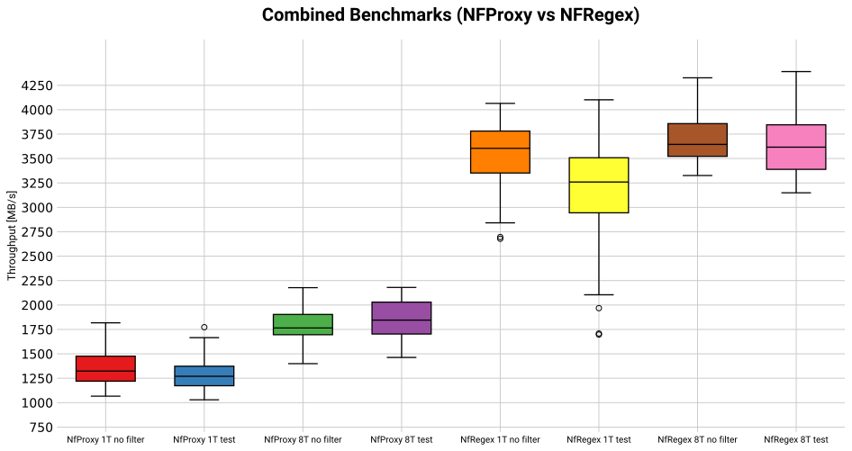
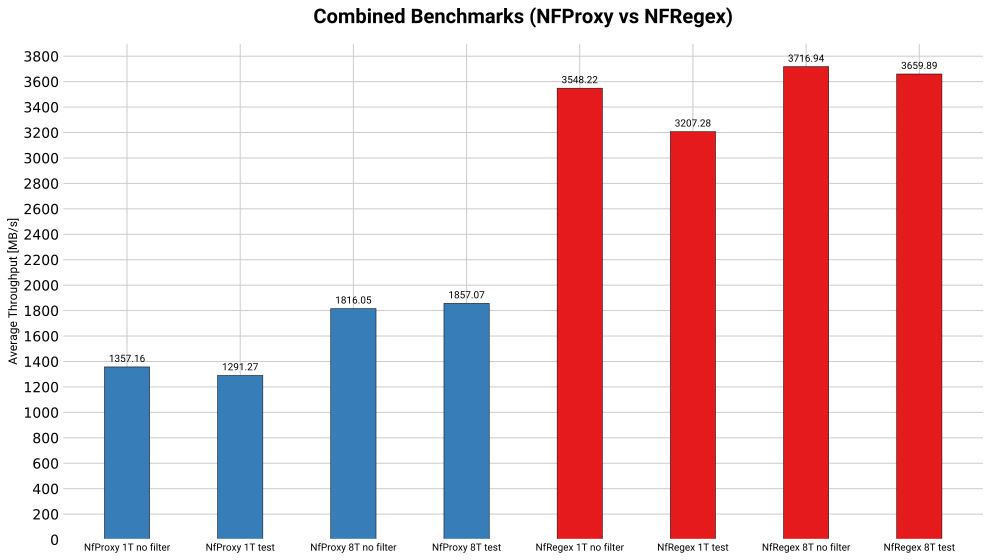

# Firegex benchmarks

## [GO BACK](../README.md)

Nothing here is a test. These scripts **measure** — they have no pass and no fail, they take minutes rather than seconds, and they are easy to misread, which is what
most of this page is about. `pytest` does not collect this directory.

| Script | What it answers |
|---|---|
| `benchmark.py` | how much bulk traffic a layer carries, against the number of patterns |
| `connbench.py` | how many short connections a second, which is the shape a CTF service actually sees |
| `stress_test_history.py` | a soak test for `HttpHistory` under load |
| `results_plotter.py` | redraws the SVGs in `results/` from the CSVs beside them |

These need more than the tests do — `pip3 install -r requirements.txt` here, on top of
the one a directory up, and `iperf3` itself installed as a package because the python
binding links against it.

# Running a benchmark

```bash
./benchmark.py -p testpassword -r 50 -d 1 -s 50 -t nfqueue
```

| Flag | Meaning |
|---|---|
| `-r, --num-of-regexes` | how many patterns to build up to; one measurement per pattern count |
| `-d, --duration` | seconds per measurement |
| `-s, --num-of-streams` | concurrent iperf3 streams |
| `-t, --transport` | `nfqueue` or `proxy` — which network layer to put in the path |
| `-o, --output-file` | CSV of `pattern count, MB/s` |

It stands up a service, measures the throughput with no filter, then adds one random
pattern at a time and measures again, using iperf3 over loopback. All the patterns live in
**one** regex filter, because that is the property worth measuring: they are compiled into
a single hyperscan database, so fifty of them should cost about what one costs.

## Reading the numbers

Three things decide whether a number here means anything at all.

**The filter has to be in the path.** `benchmark.py` creates its service with
`fail_open=False`, and that one argument is worth more than everything else on this page.
With fail-open on, the nft rule carries `bypass` and the queue is configured
`NFQA_CFG_F_FAIL_OPEN`: when the queue fills — which under fifty iperf3 streams it does
constantly — the kernel accepts packets **without inspecting them**. Measured that way the
same build reports ~32 000 MB/s instead of ~3 000, and the extra order of magnitude is
traffic that was never filtered. A benchmark of a filter has to make every packet go
through the filter.

**A pass is repeatable; a restart is not.** Three passes back to back against the same
running instance land within ~3% of each other. The same configuration measured again
after stopping and starting firegex moved by up to ~30%. So differences smaller than about
a third are not results, and any comparison across versions — each of which needs its own
instance — carries that uncertainty.

**One second per point is noisy on purpose.** `-d 1` is what the archived runs used and
what these use, so the curves are comparable with each other; it also means the wiggle
between adjacent points is measurement, not behaviour. Read the level and the slope.

# Performance

Measured on:

- MacBook Air M2, 16 GB
- OrbStack VM, Fedora Linux 43 aarch64, Linux 7.0.14, 7 CPUs
- `./benchmark.py -p testpassword -r 50 -d 1 -s 50 -t nfqueue` — and the same with
  `-t proxy` for the proxy line. **The layer is part of the measurement**, so it is part of
  every label, every filename (`5.0.0-nfqueue-8T.csv`, `5.0.0-proxy.csv`) and every table
  row below: the two differ by more than three times, and a number without its layer is not
  a number about firegex.

The `-d 1` in that command used to be load-bearing by accident. `benchmark.py` drove
iperf3 through the `iperf3` python binding, which captures libiperf's output by `dup2`-ing
stdout onto an `os.pipe()` and reads it only *after* the test returns — and a Linux pipe
holds 64 KiB. At fifty streams the JSON is 55 KB for a one-second test and 130 KB for a
five-second one, so anything past a second filled the pipe, blocked libiperf in `write()`,
and hung the benchmark for good: no output, no error, no timeout. It survived only because
the recorded runs happened to use the one duration that fits. iperf3 is now run as a
subprocess against a pipe something is draining, so `-d` is just a duration again.

## By version and thread count

Every line below was measured on that machine, in one sitting, with the filter in the path
for every packet. The versions are all driving their own `tests/benchmark.py` against their
own API — what that API is called changed across 3.x and 4.x, what is being measured did
not: a regex filter, one hyperscan database, throughput over loopback. **5.0.0** is the
tree these tests live in.

One chart per thread count, because the thread count moved a line as much as the version
did and seven lines on one pair of axes was something you decoded rather than read. The
dashed line in each is 5.0.0's **proxy** layer: not another version, the other way of
putting the same filter in the path.

### One thread



### Eight threads



### Medians

| Version | Layer | 1 thread | 8 threads | 8T / 1T |
|---|---|---|---|---|
| 3.5.3 | NFQUEUE | 1601 | 2620 | 1.6× |
| 4.0.5 | NFQUEUE | 1827 | 2461 | 1.3× |
| 5.0.0 | NFQUEUE | 1820 | 2956 | 1.6× |
| **5.0.0** | **Proxy** | **4035** | **13984** | **3.5×** |

What this supports:

- **Throughput is flat in the number of patterns**, on every version, both layers, both
  thread counts. Fifty patterns cost about what one costs. That is hyperscan doing what it
  is here for, and it is the clearest thing on either chart.
- **The proxy layer is the faster one, and the gap widens with threads**: 2.2× NFQUEUE at
  one thread, **4.7× at eight**. NFQUEUE pays a userspace round trip per packet; the proxy
  pays once per connection and then the kernel moves the bytes. Both gaps are several
  times the measurement uncertainty below, so both are results.
- **The proxy scales better across threads too** — 3.5× from one to eight, against ~1.5×
  for NFQUEUE, which is bounded by how much of its work is a per-packet trip through the
  kernel rather than something a second core can do.
- **The NFQUEUE versions are not separable at this resolution.** The spread across passes
  of the same version is as wide as the gap between versions. 5.0.0 measures highest and
  most steadily and that is as much as these numbers say; the charts are not evidence that
  it is faster than 4.0.5.

The `3.5.3-8T` pass in `results/3.5.3-8T-outlier.csv` collapsed to ~500 MB/s past the
seventeenth pattern and did not reproduce on the next pass. It is kept because leaving it
out would make the run-to-run spread look smaller than it is.

### Measured again after the nftables tables moved

`results/*-rerun.csv` is the whole table above, taken a second time after the firewall
module moved out of the shared `filter`/`mangle` tables into `fgex_filter` and
`fgex_mangle` — the kind of change that has no business costing throughput, which is why
it is worth showing that it did not. Same Mac, same protocol (`-r 50 -d 1 -s 50`), but
from a container sharing the datapath's network namespace rather than from the Fedora
machine, so read it as a second host and not as a repeat:

| Layer | 1 thread | 8 threads | 8T / 1T |
|---|---|---|---|
| NFQUEUE | 2205 *(was 1820)* | 2940 *(was 2956)* | 1.3× *(was 1.6×)* |
| **Proxy** | **4341** *(was 4035)* | **14590** *(was 13984)* | **3.4×** *(was 3.5×)* |

The proxy is 2.0× NFQUEUE at one thread and 5.0× at eight, against 2.2× and 4.7× before.
Every medians-level claim above survives; none of them survives to the decimal, which the
run-to-run spread in the same table already said.

**Duration is part of the protocol, and the numbers here are only comparable at `-d 1`.**
The same four runs at the default `-d 5` land at 1.9× and 3.9× — the layers' gap narrows
as each reading settles. Neither pair is wrong; quoting one against the other is.

`--threads` reaches **both** layers: it is passed to `cppregex` and `cpproxy`, and — since
5.0.0 — to the Rust proxy engine, which builds its tokio runtime with that many workers
instead of taking every core whatever the operator asked for. Before that the same flag
meant one thing on one layer and nothing on the other, and there could be only one proxy
line on these charts.

### Versions that can no longer be measured

`2.3.3`, `2.4.0`, `2.5.1`, `3.0.0` and `3.2.x` pin no dependency versions and either pin
no base image or pin `fedora:latest`, so building them today resolves to current packages.
Their containers **do not start**: `passlib` 1.7.4 probes its bcrypt backend at import and
today's `bcrypt` answers with `ValueError: password cannot be longer than 72 bytes`, which
kills the application at startup. `3.4.11` builds and starts but the datapath dies partway
through the benchmark under fifty streams.

Their old numbers are still in `results/` and are rendered further down, but they were
measured in 2025 on Fedora 41 and Linux 6.12. They are **not** comparable with anything
above — that machine is roughly an order of magnitude away from this one on the same
benchmark — and they are kept as a record of what was measured then, not as a baseline.

## Short connections

Bulk throughput is the shape a terminating proxy is best at and the shape a CTF service
almost never sees. The cost the proxy is supposed to pay is in *opening* a connection,
which the throughput benchmark never touches, so there is a second script for it:

```bash
./connbench.py -p testpassword [--passes 5] [-c 1500] [-s 32]
```

Open, one small request, one small response, close — measured as connections per second
against an unfiltered baseline taken in the same run.

| 5.0.0, short connections | conn/s | of unfiltered | across passes |
|---|---|---|---|
| unfiltered baseline | 11182 | — | 8437 – 14014 |
| Proxy | 10181 | 91% | 9687 – 10346 |
| NFQUEUE | 9870 | 88% | 7318 – 12117 |

**There is no measurable difference.** The medians land 3% apart and the ranges overlap
heavily, so the honest answer on this axis is "the same", and the script says so itself
rather than printing a ratio.

Getting there took three wrong answers, which is the useful part. Measuring every pass of
one layer and then every pass of the other gave the proxy a 1.4× lead twice, then a 1.0×,
then NFQUEUE a lead — because whichever went second inherited the machine's drift.
`connbench.py` now measures both layers **within** each pass and alternates which goes
first, so drift lands on both and shows up as spread instead of as a winner.

None of this is an argument for always choosing the proxy. What it costs is the kernel's
fail-open backstop — not the client's address, which both layers preserve on TCP and on
UDP alike; `-s` and `-d` on `benchmark.py` are there so you can measure the shape you
actually care about.

# Archived results (2025)

Everything below was measured on the machine described at the time — a MacBook Air M2 on
OrbStack with **Fedora 41** and Linux 6.12.13 — and is kept as the record it was. Do not
read it against the section above.

Command: `./benchmark.py -p testpassword -r 50 -d 1 -s 50`

NOTE: 8-thread performance before 2.5.0 does not change, because the source and
destination IP are always the same, so the kernel hashes every packet onto the same
thread. See
[this thread](https://netfilter.vger.kernel.narkive.com/sTP7613Y/meaning-of-nfqueue-s-queue-balance-option).
In a CTF there is usually a NAT hiding the real IPs, so this is not a hypothetical.
Firegex 2.5.0 assigns threads in userland instead, which is what makes the distribution
work.

Charts are labelled `[version]-[n_thread]T`, e.g. `2.5.0-8T`.



The advantage of multithreading is hard to see there, and much clearer with a fake load in
the filtering path:

```cpp
volatile int x = 0;
for (int i=0; i<50000; i++){
    x+=1;
}
```



## nfregex vs nfproxy (2025)

> These are **archived**, and the script that produced them is gone. It drove an API
> that no longer exists: back then `nfregex` and `nfproxy` were separate modules, and both
> were folded into `services` — what `nfproxy` did is now the **pyfilters** filter kind.
> A benchmark that cannot be run is not tooling, so only the numbers are kept, under the
> names they were recorded with rather than names anything still answers to. The current
> equivalent of this comparison is [By network layer](#by-network-layer) above.

The code under test matched this pattern with Python's `re` module:

```
(?:[a-z0-9!#$%&'*+/=?^_`{|}~-]+(?:\.[a-z0-9!#$%&'*+/=?^_`{|}~-]+)*|"(?:[\x01-\x08\x0b\x0c\x0e-\x1f\x21\x23-\x5b\x5d-\x7f]|\\[\x01-\x09\x0b\x0c\x0e-\x7f])*")@(?:(?:[a-z0-9](?:[a-z0-9-]*[a-z0-9])?\.)+[a-z0-9](?:[a-z0-9-]*[a-z0-9])?|\[(?:(?:25[0-5]|2[0-4][0-9]|[01]?[0-9][0-9]?)\.){3}(?:25[0-5]|2[0-4][0-9]|[01]?[0-9][0-9]?|[a-z0-9-]*[a-z0-9]:(?:[\x01-\x08\x0b\x0c\x0e-\x1f\x21-\x5a\x53-\x7f]|\\[\x01-\x09\x0b\x0c\x0e-\x7f])+)\])
```





nfproxy was slower than nfregex, and more flexible.





# Regenerating the charts

`results_plotter.py` reads the CSVs in `results/` and writes the SVGs beside them:

```bash
cd tests/bench && python3 results_plotter.py
```

That writes the two current charts, through one shared `line_chart()` helper, and stops.
The archived charts are behind `--archived`, because matplotlib has moved on since they
were produced and redrawing them changes six committed SVGs for no reason other than a
different font being available.
